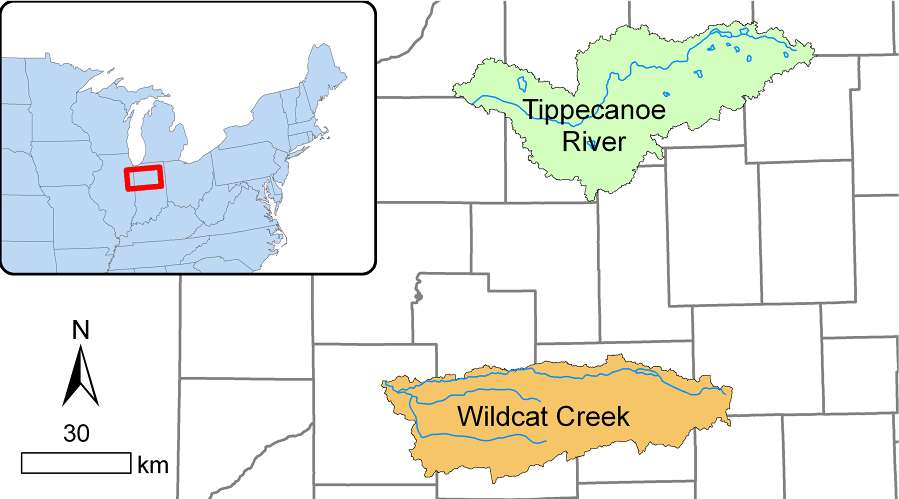
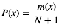

# Environmental Informatics

## Assignment 11 - Presentation Graphics

### Lab Objectives

On completion of this lab, students will be able to:

1. Generate summary figures to present analysis results for a dataset; and
2. Follow guidelines to make figures that are ready for an oral presentation.

### Reading Assignment

Review the reading materials on Blackboard under the links for Reading Materials -> Presentation Graphics.

For this assignment you will need to generate figures that comply with the [Presentation style guide used by AGU (and other professional societies) in 2019](http://www.projectionnet.com/Styleguide/presentationstyleguide.aspx).  

### The Lab Assignment

This week’s assignment is revisit the basic descriptive statistics and environmental metrics you calculated in Assignment 10, and write a program that will read in your summary metric tables from the assignment, and generate figures for a oral presentation highlighting the differences between the two rivers.  (You will create the slides for the oral presentation, you do not have to give it).  The two watersheds drain very similar areas that are very close together (see location map) in central Indiana.  There is no significant difference in climate, and both watersheds have similar land use (dominated by agricultural use).  That should mean that their hydrologic response, measured as streamflow, should be similar.  Are they?

1. Modify the Python script template called **program-11_template.py** to complete this assignment.  The template contains code defining function names and input/output parameters, as well as comment text describing what each function should accept as parameters, return as variables, and functionally what each function should do.  **DO NOT** change the name or order of the parameters being sent to or from each function.  The template defines functions that the autograder program is going to import and evaluate.  Changing the program name or the function definitions, will cause the autograder to fail even if your code "works" for you.  

2. The files **TippecanoeRiver_Discharge_03331500_19431001-20200315.txt** and **WildcatCreek_Discharge_03335000_19540601-20200315.txt** are provided again with this repository.  

3. You will need to copy the files **Annual_Metrics.csv** and **Monthly_Metrics.csv** from your assignment-10 repository into this assignment-11 repository.

4. Copy the Python script template to a new script called **program-11.py** in the same folder, and edit this script so that it does the following:

   - Copy the ReadData and ClipData functions from last week into **program-11.py** to read the daily data and clip it appropriately for figure generation (detailed below).  Importing the functions from another file will probably not work with the autograder, so just make the functions part of the new file.
     
  - Write a new function ReadMetrics() that reads the contents of both the Annual and Monthly metric CSV files into separate dataframes.  There should be one dataframe for annual and one for monthly data, each of these dataframes should include metrics for both gaging stations.  They should have a column labeled "Station" which contains the short station names ("Tippe" and "Wildcat") used in the previous assignment.

 - Your program should then produce the following figures (note that this is similar to assignment 06 Graphing Data with Python, except that you have generated your own metrics and now have to prepare figures for presentation, not for graphical analysis):
 
   - Daily flow for both streams for the last 5 years of the record. 
   - Annual coefficient of variation, TQmean and R-B index.
   - Average annual monthly flow (so 12 monthly values, maybe you need an additional function from program-10.py?).
   - Return period of annual peak flow events, which will require the following calculations.
     - Sort *Peak Flow* from highest to lowest value.
     - Assign each of these a rank from 1 to N, where rank 1 is the highest event, and rank N is the lowest event.
     - Calculate the plotting position (or exceedence probability) for each event using the Weibull plotting position equation: , where m = rank of precipitation event x, and N = number of observations. 
     - Then plot what is now effectively a scatter plot with the plotting position on the x-axis (values between 0 and 1), and the peak discharge (cfs) on the y-axis.  Note that the x-axis should go from 1 to 0 and be labeled as "Exceedence Probability".
     
5. All figures should conform to the [Ten Simple Rules for Better Figures](https://journals.plos.org/ploscompbiol/article%3Fid=10.1371/journal.pcbi.1003833) and the basic requirements outlined in the [Presentation style guide used by AGU (and other professional societies) in 2019](http://www.projectionnet.com/Styleguide/presentationstyleguide.aspx), with the following caveats:
   - Pay particular attention to font size.  Remember that if you resize the figure, the fonts change with it.  For example, if you used a minimum 20pt font, and then shrink the image, the font is now smaller that 20 pts which makes it difficult to see.  
   - As noted in the AGU document, Powerpoint uses a resolution of 96 dpi, so use that resolution when creating or converting images - otherwise detail can be lost and things like font sizes may be automatically rescaled.
   - Choose colors wisely.
   - Axis should be labeled clearly with no abbreviations and all relevant units.
   - Legends should indicate which river is which on every figure.
   - Figure titles can be in the figure image, or added in the presentation software.
   - Figures should be designed to maximize space usage on the slide, without crowding out slide components including titles, slide header or footer elements, or backgrounds.
   - I disagree with the AGU reccomendation to use JPG for figures, when figures have large areas of similar colors a loss-less format such as TIFF, BMP and PNG (depending on compression type selected) are a much better choice.  The lossy format used in JPEG works well for photos where details lost in compression are not a significant problem, but are terrible for figures where sharp lines are required.  BMP is a Microsoft image format, so in the past it has worked better than any of the others in Microsoft Powerpoint.
   - You can find tools for helping with image conversion, editing and development at [Graphical Analysis and Plotting Tools](https://wiki.itap.purdue.edu/display/environmentalinformatics/Graphical+Analysis+and+Plotting+Tools).

6. Pull your figures into a presentation software package (e.g., Powerpoint), and create a slide show with the images.  Save as a PDF file for submission.

5. Be sure that the script has a complete header comment block, appropriate in-line comments, and runs without intervention relative to where the datafile is stored in the repository.

#### What to turn in...

The following should be included in your GitHub repository:

1. A working program called **program-11.py**, which conforms to the template provided with the original repository.

2. The original data files provided with the repository and copied from your assignment-10 repository.

3. A PDF file with your presentation slides.

4. Put your input file, output files, and processing script in the assignment repository and push to GitHub. 

5. The instructor will follow-up with an invitation to submit the assignment through GradeScope.  Follow the provided instructions to submit the assignment using GitHub.  The AutoGrader will return a report on whether the submitted code met the performance checks.  If errors are found, fix the code, and resubmit.

#### Grading Rubric (50 pts Total)

| Question | Description | Score |
| -------- | ----------- | ----- |
| 1. | Write a Python script to complete the following analysis | (15.0 pts) |
| 1.1. | - Import the annual metric file as a DataFrame, using date as the index | 5.0 pts |
| 1.1. | - Import the monthly metric file as a DataFrame, using date as the index | 5.0 pts |
| 1.2. | - Clip data to correct time period. | 5.0 pts |
| 2. | Program should have clear and concise header and in-line comments | 5 pts |
| 3. | Presentation graphics: | (30 pts) |
| 3.1. | Daily flow for both streams for the last 5 years of the record. | 4 pts |
| 3.2. | Annual coefficient of variation | 4 pts |
| 3.3. | Annual time series of TQmean | 4 pts | 
| 3.4. | Annual time series of R-B index | 4 pts |
| 3.5. | Average annual monthly flow | 4 pts |
| 3.6. | Return period of annual peak flow events | 4 pts |
| 4. | Clear presentation slides including all figures | 6 pts |
